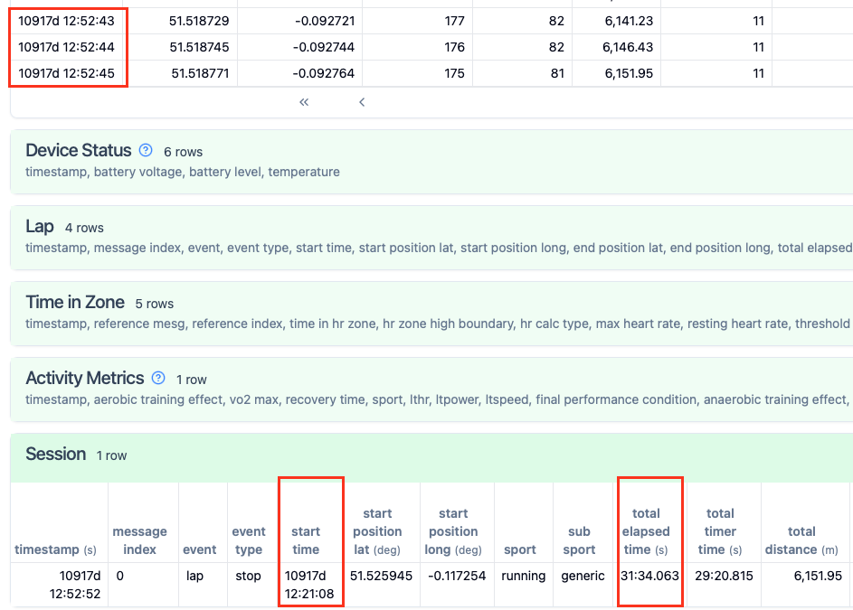

**Update:** It turns out I didn't. Strava released [this post](https://stories.strava.com/articles/explaining-the-strava-tax) explaining the "Strava tax" occurs due rounding differences between their software and other apps/devices. Anyway, I found the Strava post after I published this blog post but what follows below is still useful for anyone dealing with Garmin FIT files and their various nuances.

<hr style="border: 0; border-top: 1px solid #ccc; margin: 2em auto; width: 25%;" />

You know that incredibly annoying moment when you upload a perfectly good 10km run to Strava, only to see it reported as 9.99km? Or even worse, you just raced a 5km PB and Strava reports 4.98km! Your watch clearly shows 5.00km, but somehow those last few precious meters have vanished. Where did they go? I think I might have the answer...

Last weekend I was building a tool for converting [Garmin FIT files](https://developer.garmin.com/fit/overview/) into a nice human-readable format for data analysis. Nothing fancy, just something that would extract the data I actually care about for analysis and dump the rest. FIT files are binary format nightmares. you can't read them, they're computationally expensive to parse, and they're packed with stuff you'll never need. My plan was simple: convert them to JSON, store them an object database, and feed into ML pipelines for building models.

For anyone who hasn't had the pleasure of diving into FIT files. The FIT file is made up of various messages. Most message types you can ignore but the most important ones are:

1. **Activity** messages summarise the whole activity
2. **Session** messages can be multiple per activity (think triathlon with different sports)
3. **Lap** messages break things down further
5. **Record** messages contain all the data you actually want

I get that FIT files are created on performance constrained devices and that's why the format is the way it is. As such, record messages don't include a lap or session identifier[^1]. Instead, according to Garmin's [docs](https://developer.garmin.com/fit/cookbook/decoding-activity-files/), you need to check whether a record's timestamp falls within the time bounds of a session to know where it belongs.

Fair enough. Most FIT files probably only have a single session anyway --- you start your watch, run, stop. You just take all the record messages and be done with it. But I was doing this properly. Someone might have a multi-session activity like a triathlon where they only want the running part extracted.

So, I was writing some code to summarise a run into chunks of specified distance, which I would then feed into a model. I was instructing my AI to write the unit tests and found that one test --- which checked all the chunks honoured the original distance, time, etc of the run --- was periodically failing. Some "chunked runs" were up to 10m or so shorter than the distance reported inside the FIT file. How odd?

Meanwhile, the AI was chasing its tail, inventing increasingly creative reasons for why records were disappearing.

I didn't think that the FIT file could be incorrect. Here's the data from one run where the last three records were chopped off the end:



Here's some Python code to prove it:

```python
from datetime import datetime, timedelta

start_time = datetime.strptime("12:21:08", "%H:%M:%S")
elapsed_time = timedelta(minutes=31, seconds=34, milliseconds=63)
finish_time = start_time + elapsed_time
print("start_time", start_time.time())
print("elapsed_time", elapsed_time)
print("finish_time", finish_time.time())

third_last_record = datetime.strptime("12:52:43", "%H:%M:%S")
third_last_record < finish_time
```

Which outputs:

```
start_time 12:21:08
elapsed_time 0:31:34.063000
finish_time 12:52:42.063000
False
```

The other curious thing to note is that (as seen in the image above) the `total_distance` for the session is `6.151.95` and the cumulative distance as measured by GPS ends at `6.151.95` --- the same value. However we know that the session truncates the last three record messages and yet still reports the total distance as `6.151.95`, when it should actually be `6,135.06` based upon the `total_elapsed_time` value in the session message.

Now... If you search the web for information about this, there's the docs page I linked to above but nothing I could find that discusses this issue specifically. Anywhere. The AIs seem to know what the problem is though:

> Yes, this is a common quirk with Garmin FIT files. The issue is that the session message's total_elapsed_time and the actual record timestamps don't always align perfectly. The session message's total_elapsed_time is often calculated as the time between when you started and stopped the activity on the device. However, the device continues recording data for a few seconds after you stop the activity. This means the last few records can have timestamps that are slightly after the session's official end time.

Is this true or just some made up nonsense? Who knows? Either way, my Fenix 5 and Fenix 8 routinely generate FIT files with records with timestamps outside the bounds of their sessions. In my opinion, Garmin's own devices break the protocol. How annoying!

When faced with records that fall outside session bounds, you've got two choices:

1. Extend the session bounds to include all the orphaned records (assume they belong to the session)
2. Ignore the records that fall outside the session bounds

There's no way to know for sure without asking Strava and Garmin engineers familiar with their FIT parsing code but I think Garmin Connect does option 1[^2], while Strava does option 2. And that's why you sometimes get those infuriating tiny differences between what your watch recorded and what Strava reports.

---

## Footnotes

[^1]: Probably to save space but surely they could have spared a byte as a session identifier?
[^2]: As in, Garmin are aware that some devices generate record messages outside the bounds of a session message and so just make sure all the record messages are assigned to a session message.


